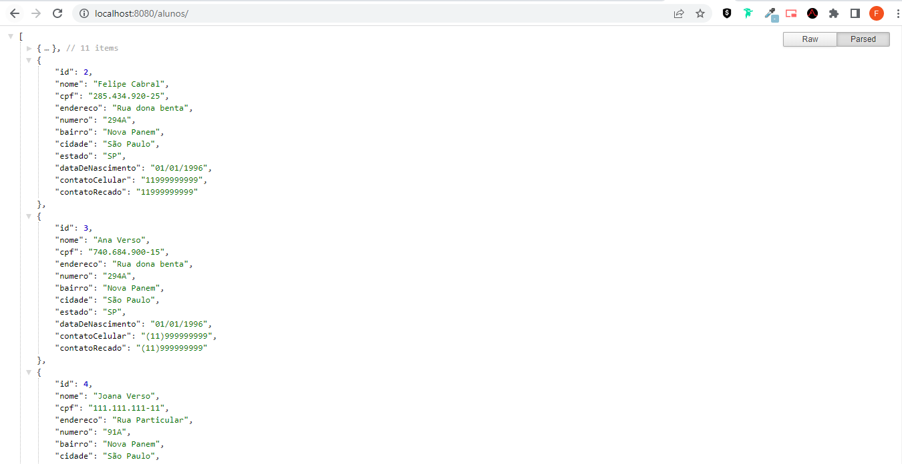
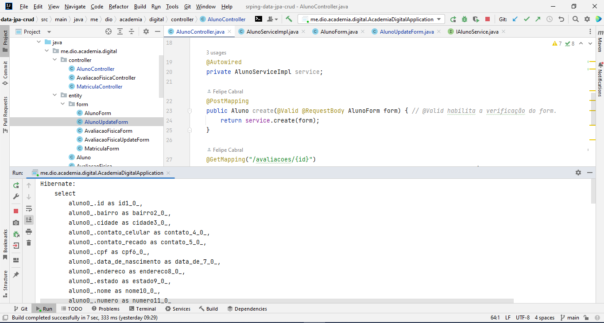
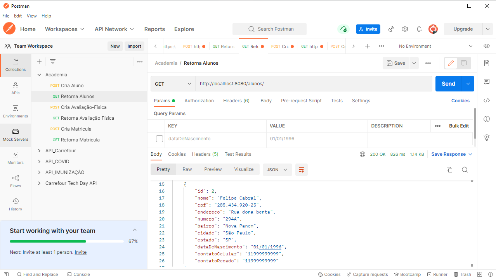

# Desafio de Projeto - Spring Data JPA com JAVA

## Objetivo do Projeto.

Ao final deste projeto, o Dev irá conhecer os principais conceitos de mapeamento objeto relacional (ORM) usando o **Spring Data JPA**. Para isso, uma **API RESTful** será desenvolvida com ênfase na modelagem de suas entidades, no domínio de uma academia de ginástica.

**Tecnologias e ferramentas utilizadas:**

- IDE IntelliJ
- Java 11
- Maven
- Spring WEB
- Spring Data JPA
- PostgreSQL
- Hibernate
- Lombok
- Postman

Projeto desenvolvido como entrega para o Bootcamp Carrefour WebDeveloper, utilizando as tecnologias e ferramentas mencionadas acima.

Repositório: https://github.com/felipecabraloliveira/spring-data-jpa-crud

### Páginas

#### Postman

> Instrutor: Camila 

> Bootcamp Carrefour Web Developer